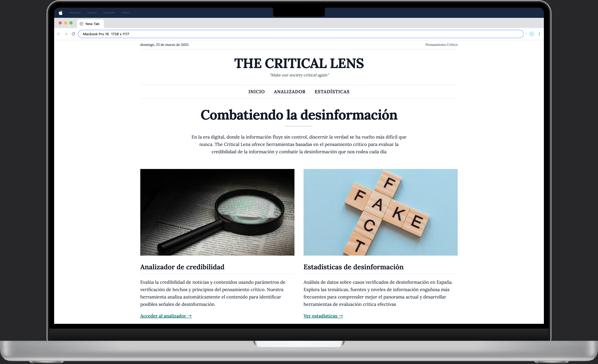

# The Critical Lens




## ⚠️ Aviso Legal

**Este proyecto es exclusivamente para fines educativos y de investigación.** La extracción de datos (scraping) implementada en este proyecto tiene como único objetivo el estudio académico y la práctica del desarrollo de software, sin fines comerciales. 

No se pretende violar los términos de servicio de ningún sitio web. Los datos extraídos no se redistribuyen ni se utilizan con fines comerciales. El desarrollador no se hace responsable del mal uso que se pueda hacer de estas herramientas.

Cualquier entidad que considere que sus derechos están siendo vulnerados puede contactar con el desarrollador para solicitar la eliminación del contenido correspondiente.

## 📝 Descripción

**The Critical Lens** es una aplicación web desarrollada con Django y Tailwind CSS que ayuda a los usuarios a combatir la desinformación mediante herramientas basadas en el pensamiento crítico. En la era digital, donde la información fluye sin control, discernir la verdad se ha vuelto más difícil que nunca. Este proyecto ofrece:

- **Analizador de Credibilidad**: Evalúa automáticamente la credibilidad de noticias y contenidos usando parámetros de verificación de hechos y principios del pensamiento crítico.
- **Estadísticas de Desinformación**: Análisis de datos sobre casos verificados de desinformación para comprender mejor el panorama actual y desarrollar herramientas de evaluación crítica efectivas.
- **Base de Datos de Verificación**: Sistema de scraping que extrae y almacena verificaciones de hechos del portal Newtral para su análisis.

Esta aplicación se basa en los conceptos y herramientas del pensamiento crítico desarrollados por la Fundación para el Pensamiento Crítico (Dr. Richard Paul y Dra. Linda Elder), cuya guía se encuentra en el directorio `/docs` del proyecto. Los criterios de análisis implementados en el servicio `ContentAnalysisService` se han desarrollado siguiendo los estándares intelectuales universales y elementos del pensamiento descritos en esta guía.

## 🚀 Tecnologías

- **Backend**: Django 5.1.7
- **Frontend**: Tailwind CSS 3.4
- **Base de datos**: PostgreSQL
- **Web Scraping**: Selenium, BeautifulSoup4
- **Testing**: Pytest

## 📋 Requisitos

- Python 3.8+
- PostgreSQL
- Node.js y NPM (para Tailwind CSS)
- Chrome WebDriver (para el scraping con Selenium)

## 🔧 Instalación

### 1. Clonar el repositorio

```bash
git clone https://github.com/tuusuario/the-critical-lens.git
cd the-critical-lens
```

### 2. Crear y activar entorno virtual

```bash
python -m venv venv
# En Windows
venv\Scripts\activate
# En macOS/Linux
source venv/bin/activate
```

### 3. Instalar dependencias

```bash
pip install -r requirements.txt
```

### 4. Configurar variables de entorno

Crea un archivo `.env` en la raíz del proyecto con el siguiente contenido:

```
# Django settings
SECRET_KEY=django-insecure-your-secure-key-here
DEBUG=True
ALLOWED_HOSTS=127.0.0.1,localhost

# Database settings
DB_NAME=critical_lens
DB_USER=postgres
DB_PASSWORD=postgres
DB_HOST=localhost
DB_PORT=5432
```

### 5. Configurar base de datos PostgreSQL

```bash
# Crear base de datos en PostgreSQL
createdb critical_lens
```

### 6. Aplicar migraciones

```bash
python manage.py migrate
```

### 7. Configurar Tailwind CSS

### Instalar dependencias de Node.js
```bash
cd theme/static_src
npm install
```

### Compilar estilos CSS
```bash
python manage.py tailwind start
```

### 8. Ejecutar servidor de desarrollo

```bash
python manage.py runserver
```

La aplicación estará disponible en http://127.0.0.1:8000/

### 9. Crear usuario administrador

Para acceder al panel de administración de Django, necesitas crear un superusuario:

```bash
python manage.py createsuperuser
```

Sigue las instrucciones en la terminal para configurar el nombre de usuario, correo electrónico y contraseña. Una vez completado, podrás acceder al panel de administración en http://127.0.0.1:8000/admin/

## 🔍 Uso

### Analizador de Credibilidad

El analizador evalúa diferentes aspectos de un contenido siguiendo los principios del pensamiento crítico:

1. **Título**: Verifica la longitud y estructura del título, evaluando su claridad y precisión.
2. **Autor**: Verifica la credibilidad de la fuente, aplicando criterios de autoridad y confiabilidad.
3. **Contenido**: Analiza el lenguaje empleado, buscando palabras sensacionalistas o emocionalmente cargadas que puedan indicar sesgo o manipulación.
4. **Fuente**: Compara con una base de datos de fuentes de mayor y menor credibilidad, basada en el historial de verificación de hechos.

Cada uno de estos aspectos recibe una puntuación y retroalimentación detallada, generando una evaluación global de la credibilidad del contenido.

URL: `/analyzer/`

### Estadísticas de Desinformación

Visualiza datos sobre la desinformación verificada a partir de los artículos fact-check del portal Newtral, incluyendo:
* Distribución por categorías de verificación
* Fuentes más frecuentes de contenido verificado
* Temáticas más comunes de desinformación

URL: `/statistics/`

## 🤖 Scraping

La aplicación incluye un sistema de scraping que extrae verificaciones de hechos del portal Newtral.

### Ejecutar el scraper

```bash
# Extraer 10 artículos (respeta archivo robots.txt de Newtral)
python manage.py scrape_newtral --limit 10 
```

## 🧪 Tests

### Ejecutar todos los tests

```bash
pytest -v apps/scraper/tests/
```

### Ejecutar tests específicos

```bash
# Test del scraper base
pytest apps/scraper/tests/test_base_scraper.py

# Test de rotación de user agents
pytest -v apps/scraper/tests/test_user_agent_rotation.py

# Test de extracción de Newtral
pytest apps/scraper/tests/test_newtral_scraper.py
```

## 📚 Estructura del proyecto

El proyecto sigue una arquitectura modular orientada a buenas prácticas de desarrollo Django:

```
the-critical-lens/
├── apps/                        # Aplicaciones Django (estructura modular)
│   ├── analyzer/                # App de análisis de credibilidad
│   │   ├── services.py          # Servicio de análisis de contenido
│   │   ├── templates/           # Plantillas HTML
│   │   ├── views.py             # Vistas
│   │   └── ...
│   ├── dashboard/               # App de inicio y dashboard
│   │   ├── templates/           # Plantillas HTML
│   │   ├── views.py             # Vistas
│   │   └── ...
│   └── scraper/                 # App de scraping de fact-checks
│       ├── management/          # Comandos personalizados
│       ├── migrations/          # Migraciones de base de datos
│       ├── models.py            # Modelos de datos
│       ├── scrapers/            # Implementaciones de scrapers
│       │   ├── base.py          # Scraper base
│       │   └── newtral.py       # Scraper para Newtral
│       ├── services.py          # Servicio de scraping
│       ├── utils/               # Utilidades (logging, user agents, etc.)
│       ├── views.py             # Vistas (estadísticas)
│       └── ...
├── core/                        # Configuración principal de Django
│   ├── settings.py              # Configuración del proyecto
│   ├── urls.py                  # URLs del proyecto
│   └── ...
├── docs/                        # Documentación del proyecto
│   └── miniguia_pensamiento_critico.pdf  # Guía que fundamenta los criterios de análisis
├── templates/                   # Plantillas globales
│   └── base.html                # Plantilla base
├── theme/                       # Configuración de Tailwind CSS
│   └── static_src/              # Archivos fuente para Tailwind
├── static/                      # Archivos estáticos para producción
│   └── img/                     # Imágenes del proyecto
├── .env_example                 # Ejemplo de variables de entorno
├── .gitignore                   # Archivos ignorados por Git
├── manage.py                    # Script de administración de Django
├── pytest.ini                   # Configuración de Pytest
└── requirements.txt             # Dependencias del proyecto
```

Esta estructura sigue buenas prácticas de desarrollo Django, con clara separación de responsabilidades y organización modular.

## 📄 Modelos de datos

### Diagrama de la base de datos

La siguiente imagen muestra la estructura relacional de la base de datos:

[Ver diagrama de la base de datos](https://dbdiagram.io/d/67e1377a75d75cc8443a3b7d)

Esta estructura permite gestionar eficientemente tanto las categorías de verificación como los artículos extraídos mediante el scraper.

### VerificationCategory

Almacena las categorías de verificación utilizadas para clasificar los fact-checks.

| Campo | Tipo | Descripción |
|-------|------|-------------|
| name | CharField | Nombre de la categoría (ej. "Falso", "Engañoso") |
| description | TextField | Descripción de la categoría |
| color | CharField | Código de color para representación visual |

### FactCheckArticle

Almacena artículos de verificación de hechos extraídos del portal Newtral.

| Campo | Tipo | Descripción |
|-------|------|-------------|
| title | CharField | Título del artículo |
| url | URLField | URL única del artículo |
| publish_date | DateField | Fecha de publicación |
| verification_category | ForeignKey | Categoría de verificación |
| claim | TextField | Afirmación verificada |
| claim_source | CharField | Fuente de la afirmación |
| content | TextField | Contenido del artículo |
| tags | CharField | Etiquetas temáticas |
| author | CharField | Autor del artículo |
| scraped_at | DateTimeField | Fecha de extracción |
| is_processed | BooleanField | Estado de procesamiento |

## ⏭️ Próximos Pasos

### Machine Learning para un Análisis Avanzado
- Implementación de modelos de NLP (Procesamiento de Lenguaje Natural) para un análisis más preciso del contenido
- Uso de APIs como OpenAI, HuggingFace o Google Cloud NLP para enriquecer el análisis
- Integración con datasets de fact-checking para entrenar modelos propios de detección de fake news
- Desarrollo de un sistema de puntuación más granular basado en técnicas de machine learning

### Mejoras de Infraestructura
- Dockerización del proyecto para facilitar el despliegue y desarrollo
  ```bash
  # Ejemplo de estructura básica de dockerización prevista
  docker-compose up -d
  ```
- Implementación de CI/CD para pruebas automáticas y despliegue
- Despliegue en plataformas como Render o Railway para acceso público

## 👥 Contribuir

Si deseas contribuir a este proyecto, por favor:

1. Haz un fork del repositorio
2. Crea una rama para tu funcionalidad (`git checkout -b feature/nueva-funcionalidad`)
3. Haz commit de tus cambios (`git commit -am 'Añade nueva funcionalidad'`)
4. Sube la rama (`git push origin feature/nueva-funcionalidad`)
5. Abre un Pull Request

## 📜 Licencia

Este proyecto está licenciado bajo la Licencia MIT
